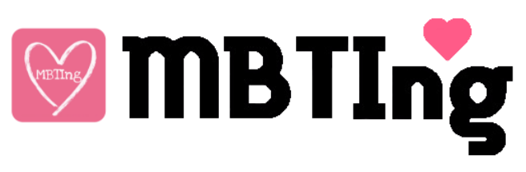
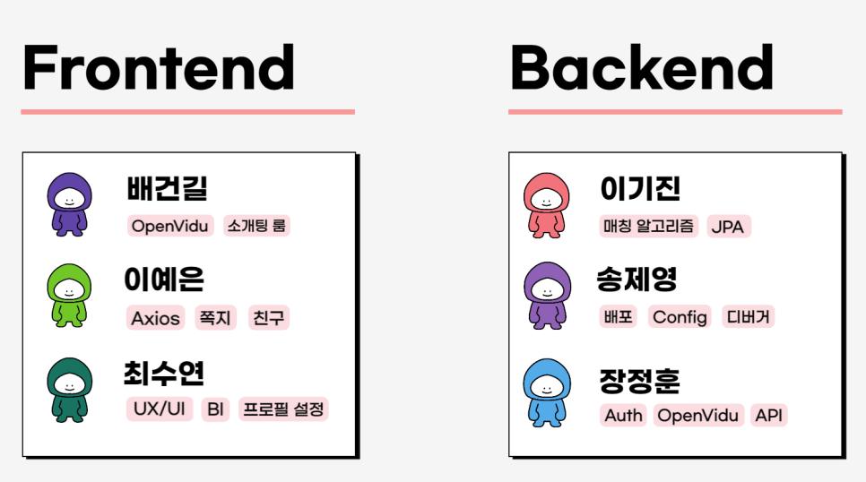
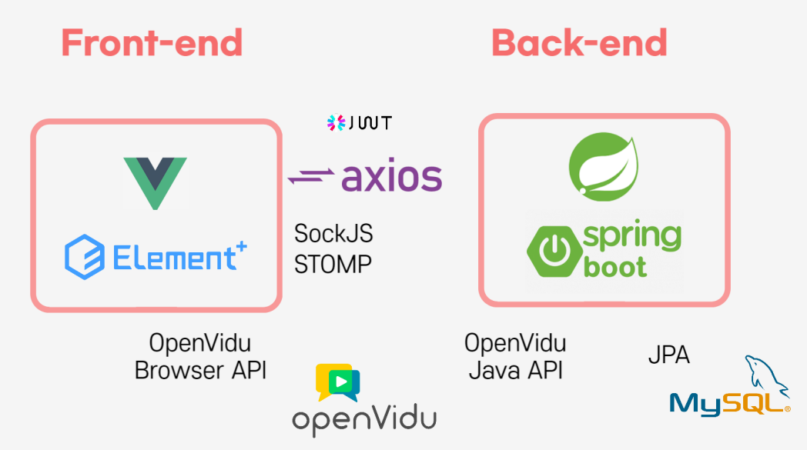

# 💕 MBTIng

#### 로고소개

`MBTI` + `Meeting` 의 합성어로 요즘 핫한 주제인 **MBTI**와 블라인드 **소개팅**을 결합한 서비스

------

## 📑프로젝트 개요

>복잡한 가입심사, 실시간 소통불가능, 유령알바사용자 는 **이제그만!!**
>
>**MBTIng**은 기존의 불편한 구조의 소개팅서비스가 아닌 간편한 **실시간 소개팅 서비스**입니다.
>
>WebRTC 기술을 활용한 라이브 기능 기반 시스템

## 📆 개발 기간

2022.07.11 ~ 2022.08.19(6주)

## 👨‍👨‍👧‍👧팀원소개

## 🎞UCC

- [MBTIng UCC 링크]()

## 📌주요기능

#### ✔회원가입

#### ✔소개팅매칭

#### ✔소개팅룸

#### ✔피플(친구관리)

#### ✔MBTI컨텐츠

- **나의 이상형 MBTI테스트**

- **나의 MBTI 테스트**

- **MBTI 월드컵**

- **MBTI별 매칭성공률**

## 🌱 개발 환경

- [개발 환경 상세 문서](./exec/how-to-build-and-deploy.md)

## 📝 기획/설계 문서

- [기획/설계 문서](./exec/plan.md)

## 💻 서비스 배포 문서

- [서비스 배포 문서](./exec/how-to-run-on-dev-local.md)

## 🔖 변경 기록 

1.0(2022.08.18)

#### v1.0 (2022.08.18)

- 회원기능
  - 카카오톡 간편로그인
  - 회원가입
  - 마이페이지
    - 수정 & 탈퇴
- 소개팅매칭
  - 매칭알고리즘
  - 상대방 MBTI 카드 제공
  - 소개팅룸 입장
- 소개팅룸 기능
  - 채팅
  - 화상채팅
  - 마이크 On/Off
  - 카메라 On/Off
  - 상대방 MBTI & 관심사 해시태그
  - 타이머
  - 그린 & 레드라이트
  - 친구추가
  - 신고기능
- 피플(친구) 기능
  - 추가된 친구관리
    - 친구 & MBTI 검색
    - 친구프로필 보기
    - 쪽지보내기
    - 친구삭제
  - 쪽지기능
    - 쪽지검색
    - 보낸쪽지확인
    - 받은쪽지확인
    - 신고기능
- MBTI 컨텐츠 기능
  - 나의 이상형 MBTI 테스트
  - 나의 MBTI 테스트
  -  MBTI 월드컵
  - MBTI별 매칭 성공률
